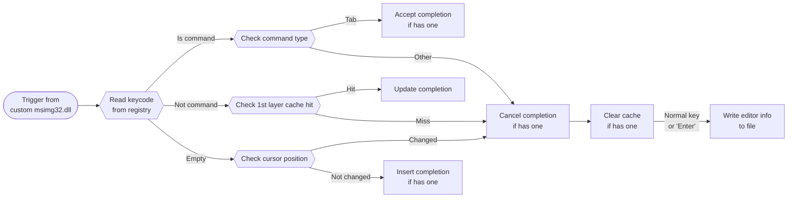

# si-coding-macros

## Design

```mermaid
flowchart LR
    macroStart([Trigger from \n custom msimg32.dll]) --> readKeycode{{Read keycode \n from registry}}
    readKeycode -- Is command --> checkCommandType{{Check command type}}
    readKeycode -- Not command --> checkCacheHit{{Check 1st layer cache hit}}
    readKeycode -- Empty --> checkCursor{{Check cursor position}}
    checkCommandType -- Tab --> acceptCompletion[Accept completion \n if has one]
    checkCommandType -- Other ---> cancelCompletion[Cancel completion \n if has one] --> clearCache[Clear cache \n if has one]
    checkCacheHit -- Hit --> updateCompletion[Update completion]
    checkCacheHit -- Miss ---> cancelCompletion
    checkCursor -- Changed ---> cancelCompletion
    checkCursor -- Not changed --> insertCompletion[Insert completion \n if has one]

    clearCache -- Normal key \n or 'Enter' --> writeInfo[Write editor info \n to file]
```