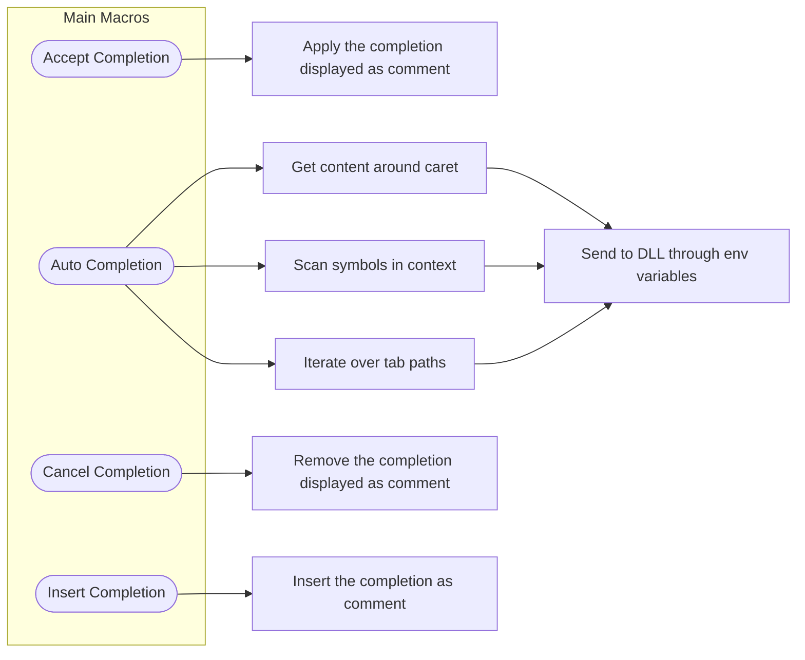

# cmw-coder-macros

## Design

```mermaid
flowchart LR
	subgraph Main Macros
    	Export_AcceptCompletion([Accept Completion])
    	Export_AutoCompletion([Auto Completion])
    	Export_CancelCompletion([Cancel Completion])
    	Export_InsertCompletion([Insert Completion])
    end
    Export_AcceptCompletion --> applyCompletion[Apply the completion displayed as comment]
    Export_AutoCompletion --> grabContext[Get content around caret]
    Export_AutoCompletion --> scanSymbols[Scan symbols in context]
    Export_AutoCompletion --> iterateTabs[Iterate over tab paths]
    grabContext --> sendToDll[Send to DLL through env variables]
    scanSymbols --> sendToDll
    iterateTabs --> sendToDll
    Export_CancelCompletion --> removeCompletion[Remove the completion displayed as comment]
    Export_InsertCompletion --> insertCompletion[Insert the completion as comment]
```
