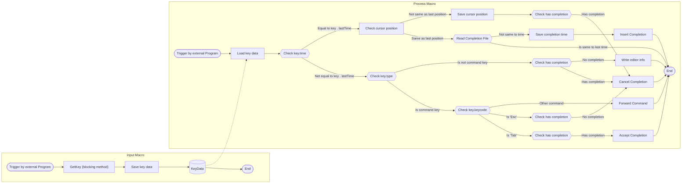

# si-coding-macros

## Design

```mermaid
flowchart LR
    subgraph Input Macro
        inputMacroStart([Trigger by external Program]) --> getKey["GetKey (blocking method)"] --> saveKey[Save key data]
        saveKey --> keyData[(KeyData)] --> inputMacroEnd([End])
    end

    subgraph Process Macro
        processMacroStart([Trigger by external Program]) --> loadKey[Load key data] --> checkKeyTime{{Check key.time}}
        checkKeyTime -- Not equal to key . lastTime --> checkKeyType{{Check key.type}}
        checkKeyTime -- Equal to key . lastTime --> checkCursorPosition[Check cursor position]
        checkCursorPosition -- Same as last position --> checkCompletionFile{{Read Completion File}}
        checkCursorPosition -- Not same as last position --> saveCursorPosition[Save cursor position] --> checkHasCompletion4{{Check has completion}} -- Has completion --> cancelCompletion[Cancel Completion]
        checkKeyType -- Is command key --> checkKeyCode{{Check key.keycode}}
        checkKeyType -- Is not command key --> checkHasCompletion1{{Check has completion}}
        checkKeyCode -- Is 'Tab' --> checkHasCompletion2{{Check has completion}} -- Has completion --> acceptCompletion[Accept Completion] --> processMacroEnd([End])
        checkKeyCode -- Is 'Esc' --> checkHasCompletion3{{Check has completion}} -- No completion --> cancelCompletion --> processMacroEnd
        checkKeyCode -- Other command --> forwardCommand[Forward Command] --> processMacroEnd
        checkHasCompletion1 -- Has completion --> cancelCompletion
        checkHasCompletion1 -- No completion --> writeEditorInfo[Write editor info] --> processMacroEnd
        checkCompletionFile -- Is same to last time --> processMacroEnd
        checkCompletionFile -- Not same to time --> saveCompletionTime[Save completion time] --> insertCompletion[Insert Completion] --> processMacroEnd
    end

    keyData -.-> loadKey
```